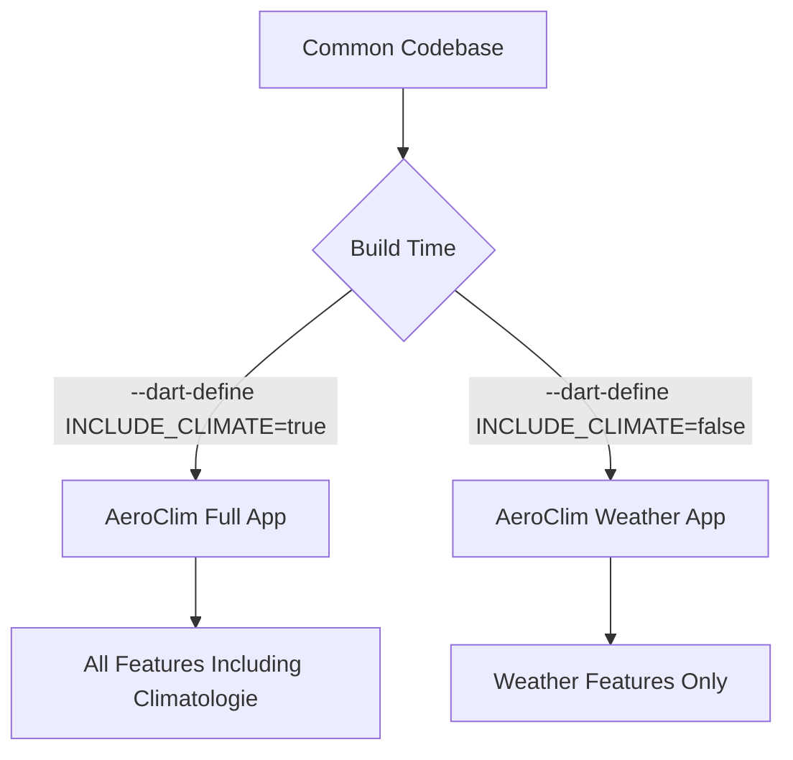
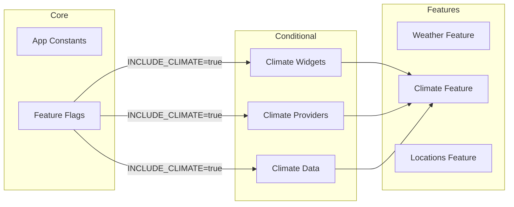

# Plan: Conditional Compilation for Two Application Variants

## Objective
Create two distinct applications from a common codebase:
1. **AeroClim Full** - The current application with all features including Climatologie
2. **AeroClim Weather** - The same application WITHOUT the Climatologie feature (historical temperature min/max)

## Analysis Summary

### Climate Feature Scope
The climate feature is located in [`lib/features/climate/`](lib/features/climate/) and includes:

| File | Purpose |
|------|---------|
| [`climate_repository.dart`](lib/features/climate/data/climate_repository.dart) | Loads climate normals from CSV assets |
| [`climate_model.dart`](lib/features/climate/domain/climate_model.dart) | Defines `ClimateNormal` and `WeatherDeviation` classes |

### Integration Points
The climate feature is referenced in:

| File | Usage |
|------|-------|
| [`home_screen.dart`](lib/features/weather/presentation/screens/home_screen.dart) | Loads climate normals, manages climate location selection |
| [`weather_display_widget.dart`](lib/features/weather/presentation/widgets/weather_display_widget.dart) | Displays climate location info |
| [`weather_chart_widget.dart`](lib/features/weather/presentation/widgets/weather_chart_widget.dart) | Uses climate normals for deviation calculations |
| [`weather_table_widget.dart`](lib/features/weather/presentation/widgets/weather_table_widget.dart) | Shows temperature deviations |
| [`chart_helpers.dart`](lib/core/widgets/chart_helpers.dart) | Deviation calculation logic |
| [`location_provider.dart`](lib/features/locations/presentation/providers/location_provider.dart) | Manages climate locations |
| [`location_model.dart`](lib/features/locations/domain/location_model.dart) | Defines `ClimateLocationInfo` |
| [`location_repository.dart`](lib/features/locations/data/location_repository.dart) | Stores climate location data |
| [`location_selector.dart`](lib/features/weather/presentation/widgets/control_panel/location_selector.dart) | Climate location dropdown |
| [`control_panel_widget.dart`](lib/features/weather/presentation/widgets/control_panel_widget.dart) | Passes climate dropdown items |

### Climate Data Assets
CSV files in [`assets/data/`](assets/data/):
- `climatologie_00460_Berus_1961_1990.csv`
- `climatologie_01072_Bad-Durkheim_1961_1990.csv`
- `climatologie_04336_Saarbrucken-Ensheim_1961_1990.csv`
- `climatologie_04339_Saarbrucken-Sankt-Johann_1961_1990.csv`
- `climatologie_05244_Volklingen-Stadt_1961_1982.csv`
- `climatologie_06217_Saarbrucken-Burbach_2001_2010.csv`

---

## Implementation Strategy

### Approach: Dart Compilation Constants
Use Flutter's `--dart-define` flag to create compile-time constants that conditionally include/exclude the climate feature.



### Architecture Overview



---

## Detailed Implementation Steps

### Step 1: Create Feature Flag System
Create a central configuration file to manage feature flags.

**File: [`lib/core/config/app_config.dart`](lib/core/config/app_config.dart)** (new)
```dart
class AppConfig {
  static const bool includeClimate = bool.fromEnvironment(
    'INCLUDE_CLIMATE',
    defaultValue: true,
  );
  
  static String get appName => includeClimate ? 'AeroClim' : 'AeroClim Weather';
  static String get versionSuffix => includeClimate ? '' : '-weather';
}
```

### Step 2: Create Conditional Widget Wrappers
Create utility widgets that conditionally render content.

**File: [`lib/core/widgets/conditional_widget.dart`](lib/core/widgets/conditional_widget.dart)** (new)
```dart
import 'package:flutter/widgets.dart';
import '../config/app_config.dart';

class ClimateFeature extends StatelessWidget {
  final Widget child;
  
  const ClimateFeature({super.key, required this.child});
  
  @override
  Widget build(BuildContext context) {
    if (!AppConfig.includeClimate) return const SizedBox.shrink();
    return child;
  }
}
```

### Step 3: Refactor home_screen.dart
Modify [`home_screen.dart`](lib/features/weather/presentation/screens/home_screen.dart) to conditionally:
- Load climate normals
- Display climate location selector
- Pass climate data to child widgets

### Step 4: Refactor Weather Display Components
Update the following widgets to handle null/empty climate data:
- [`weather_display_widget.dart`](lib/features/weather/presentation/widgets/weather_display_widget.dart)
- [`weather_chart_widget.dart`](lib/features/weather/presentation/widgets/weather_chart_widget.dart)
- [`weather_table_widget.dart`](lib/features/weather/presentation/widgets/weather_table_widget.dart)

### Step 5: Update Location System
Modify location-related files to conditionally include climate locations:
- [`location_provider.dart`](lib/features/locations/presentation/providers/location_provider.dart)
- [`location_repository.dart`](lib/features/locations/data/location_repository.dart)
- [`location_selector.dart`](lib/features/weather/presentation/widgets/control_panel/location_selector.dart)

### Step 6: Conditional Asset Bundling
Update [`pubspec.yaml`](pubspec.yaml) to conditionally include climate data assets.

### Step 7: Platform-Specific Configuration

#### Android
Create flavor-specific configurations in [`android/app/build.gradle.kts`](android/app/build.gradle.kts):
```kotlin
android {
    flavorDimensions += "climate"
    productFlavors {
        create("full") {
            dimension = "climate"
            applicationId = "com.example.aeroclim"
            resValue("string", "app_name", "AeroClim")
        }
        create("weather") {
            dimension = "climate"
            applicationId = "com.example.aeroclim.weather"
            resValue("string", "app_name", "AeroClim Weather")
        }
    }
}
```

#### iOS
Create schemes for each variant in Xcode with different bundle identifiers.

#### Web
No special configuration needed - use dart-define flags directly.

### Step 8: Create Build Scripts

**File: `build_full.sh`** (new)
```bash
#!/bin/bash
flutter build apk --dart-define=INCLUDE_CLIMATE=true
```

**File: `build_weather.sh`** (new)
```bash
#!/bin/bash
flutter build apk --dart-define=INCLUDE_CLIMATE=false
```

---

## Files to Modify

| File | Changes |
|------|---------|
| [`lib/main.dart`](lib/main.dart) | Use `AppConfig.appName` for app title |
| [`lib/features/weather/presentation/screens/home_screen.dart`](lib/features/weather/presentation/screens/home_screen.dart) | Conditional climate loading and UI |
| [`lib/features/weather/presentation/widgets/weather_display_widget.dart`](lib/features/weather/presentation/widgets/weather_display_widget.dart) | Handle missing climate data |
| [`lib/features/weather/presentation/widgets/weather_chart_widget.dart`](lib/features/weather/presentation/widgets/weather_chart_widget.dart) | Conditional deviation display |
| [`lib/features/weather/presentation/widgets/weather_table_widget.dart`](lib/features/weather/presentation/widgets/weather_table_widget.dart) | Conditional deviation column |
| [`lib/features/locations/presentation/providers/location_provider.dart`](lib/features/locations/presentation/providers/location_provider.dart) | Conditional climate location management |
| [`lib/features/locations/data/location_repository.dart`](lib/features/locations/data/location_repository.dart) | Conditional climate location data |
| [`lib/features/weather/presentation/widgets/control_panel/location_selector.dart`](lib/features/weather/presentation/widgets/control_panel/location_selector.dart) | Hide climate dropdown |
| [`lib/features/weather/presentation/widgets/control_panel_widget.dart`](lib/features/weather/presentation/widgets/control_panel_widget.dart) | Conditional climate dropdown |
| [`pubspec.yaml`](pubspec.yaml) | Conditional asset inclusion |
| [`android/app/build.gradle.kts`](android/app/build.gradle.kts) | Android flavors |

## Files to Create

| File | Purpose |
|------|---------|
| [`lib/core/config/app_config.dart`](lib/core/config/app_config.dart) | Feature flags and app configuration |
| [`lib/core/widgets/conditional_widget.dart`](lib/core/widgets/conditional_widget.dart) | Conditional rendering utilities |
| `build_full.sh` | Build script for full app |
| `build_weather.sh` | Build script for weather-only app |

---

## Alternative Approaches Considered

### 1. Separate Packages
Create a `climate` package that is conditionally imported.
- **Pros**: Clean separation, optional dependency
- **Cons**: More complex project structure, harder to maintain

### 2. Git Branches
Maintain separate branches for each variant.
- **Pros**: Complete separation
- **Cons**: Divergence, merge conflicts, maintenance burden

### 3. Flutter Flavors Only
Use only Android/iOS flavors without dart-define.
- **Pros**: Native platform support
- **Cons**: Doesn't handle conditional code at compile time

### Selected Approach: Dart Compilation Constants
This approach provides:
- ✅ Single codebase
- ✅ Compile-time code exclusion (no dead code in production)
- ✅ Platform-agnostic (works on Android, iOS, Web)
- ✅ Simple build process
- ✅ Easy to maintain

---

## Testing Strategy

1. **Unit Tests**: Test feature flag behavior
2. **Widget Tests**: Test conditional widget rendering
3. **Integration Tests**: Test both app variants end-to-end
4. **Manual Testing**: Verify both builds on each platform

---

## Questions for Clarification

1. Should the weather-only app have a different app icon, or just a different name?
2. Should both apps be able to coexist on the same device (different package names)?
3. Are there any other features besides Climatologie that should be conditionally excluded?
4. Should the weather-only app display any indication that climate data is unavailable, or should it simply not show the feature?
