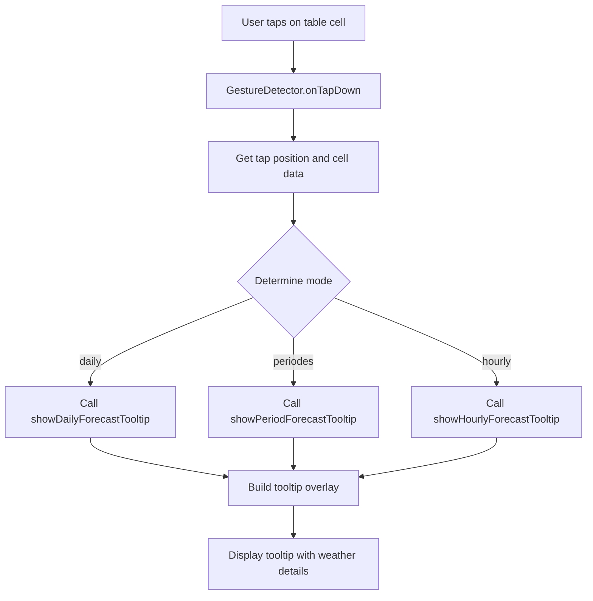

# Plan: Add Tooltip to Table Comp View

## Overview

Add tooltip functionality to the "table comp" view (comparison table) so that when a user clicks on a cell, a tooltip is shown with detailed weather information, similar to the graph view. This should work for all three temporal modes:
- **Journalier** (daily)
- **Aperçu** (periods)
- **Horaire** (hourly)

## Current Implementation Analysis

### Comparison Table Widget
- Located at: [`comparison_table_widget.dart`](lib/features/weather/presentation/widgets/comparison_table_widget.dart)
- Displays weather data in a table format comparing different weather models
- Has three display modes: `daily`, `periodes`, `hourly`
- Currently does NOT have any tooltip functionality

### Weather Tooltip
- Located at: [`weather_tooltip.dart`](lib/features/weather/presentation/widgets/utils/weather_tooltip.dart)
- Static methods for showing tooltips:
  - `showDailyTooltip` - for daily weather data
  - `showHourlyTooltip` - for hourly weather data  
  - `showPeriodTooltip` - for period weather data
  - `showComparisonTooltip` - for multi-model comparison (simpler version)
- Uses Flutter Overlay to display tooltips
- Has a `_buildTooltip` method that creates detailed tooltips with temperature, precipitation, wind info, etc.

### Graph View Implementation
- Located at: [`weather_chart_widget.dart`](lib/features/weather/presentation/widgets/weather_chart_widget.dart)
- Uses `GestureDetector` with `onTapUp` to detect tap events
- Calls appropriate tooltip method based on display type and mode

## Implementation Plan

### Step 1: Add GestureDetector to Table Cells

Wrap the cell widgets in `GestureDetector` or `InkWell` to detect tap events. The cells are built in:
- `_buildDailyCell` - for daily mode
- `_buildPeriodCell` - for period mode
- `_buildHourlyCell` - for hourly mode

### Step 2: Create New Tooltip Method for Table Cells

Create a new static method in `WeatherTooltip` class that can show detailed weather information for a specific model's data. This will be similar to the existing tooltip methods but tailored for the table view.

Options:
1. **Reuse existing methods** - The existing `showDailyTooltip`, `showHourlyTooltip`, and `showPeriodTooltip` can be used, but they need the forecast data and index
2. **Create new method** - Create a `showTableCellTooltip` method that handles all three modes

**Recommended approach**: Reuse existing methods by passing the appropriate data.

### Step 3: Implementation Details

#### For Daily Mode (Journalier)
- Each cell contains a `DailyForecast` object
- Use `WeatherTooltip.showDailyTooltip` or create a variant that shows single model data
- Display: temperature max/min, precipitation, wind info, weather description

#### For Period Mode (Aperçu)
- Each cell contains a `PeriodForecast` object
- Use `WeatherTooltip.showPeriodTooltip` or create a variant
- Display: average temperature, apparent temperature, precipitation, wind info

#### For Hourly Mode (Horaire)
- Each cell contains an `HourlyForecast` object
- Use `WeatherTooltip.showHourlyTooltip` or create a variant
- Display: temperature, apparent temperature, precipitation, wind info

### Step 4: Code Changes Required

#### 4.1 Modify `comparison_table_widget.dart`

```dart
// Add import for WeatherTooltip
import 'package:aeroclim/features/weather/presentation/widgets/utils/weather_tooltip.dart';

// Wrap cells with GestureDetector
Widget _buildDailyCell(DailyForecast d, {String? modelKey}) {
  return GestureDetector(
    onTapDown: (details) {
      _showDailyCellTooltip(d, modelKey, details.globalPosition);
    },
    child: _buildCellContainer(
      children: [
        // ... existing cell content
      ],
    ),
  );
}

// Add method to show tooltip
void _showDailyCellTooltip(DailyForecast d, String? modelKey, Offset position) {
  // Show tooltip with detailed weather info
  WeatherTooltip.showDailyForecastTooltip(
    context,
    d,
    position,
    modelName: modelKey != null ? _modelNames[modelKey] : null,
  );
}
```

#### 4.2 Add New Tooltip Method in `weather_tooltip.dart`

```dart
/// Show tooltip for a single daily forecast (for table view)
static void showDailyForecastTooltip(
  BuildContext context,
  DailyForecast forecast,
  Offset position, {
  String? modelName,
}) {
  final String formattedDate = DateFormat(
    'EEEE, d MMMM',
    'fr_FR',
  ).format(forecast.date);
  
  final title = modelName != null 
    ? '$formattedDate - $modelName' 
    : formattedDate;
  
  _buildTooltip(
    context,
    position,
    title,
    forecast,
  );
}

/// Show tooltip for a single hourly forecast (for table view)
static void showHourlyForecastTooltip(
  BuildContext context,
  HourlyForecast forecast,
  Offset position, {
  String? modelName,
}) {
  // Similar implementation
}

/// Show tooltip for a single period forecast (for table view)
static void showPeriodForecastTooltip(
  BuildContext context,
  PeriodForecast forecast,
  Offset position, {
  String? modelName,
}) {
  // Similar implementation
}
```

### Step 5: Visual Design

The tooltip should match the existing tooltip design used in graph view:
- Semi-transparent blue-grey gradient background
- White text with proper hierarchy
- Close button in top-right corner
- Auto-dismiss after 10 seconds
- Display model name in header when available

## Files to Modify

1. **[`lib/features/weather/presentation/widgets/comparison_table_widget.dart`](lib/features/weather/presentation/widgets/comparison_table_widget.dart)**
   - Add import for `WeatherTooltip`
   - Wrap cell widgets with `GestureDetector`
   - Add tap handlers to show tooltips

2. **[`lib/features/weather/presentation/widgets/utils/weather_tooltip.dart`](lib/features/weather/presentation/widgets/utils/weather_tooltip.dart)**
   - Add new methods for showing single forecast tooltips:
     - `showDailyForecastTooltip`
     - `showHourlyForecastTooltip`
     - `showPeriodForecastTooltip`

## Architecture Diagram



## Testing Considerations

- Test on different screen sizes
- Test tooltip positioning near screen edges
- Test dismissal behavior (tap close button, auto-dismiss)
- Test all three temporal modes
- Test with missing data (null values)
